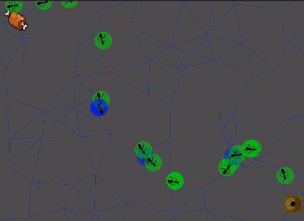

## ACO implementation

In this project I implemented ACO for fun. ACO stands for ant colony optimization ant it is a metaheuristic, which is basicaly an algorithm that can be used to solve a vast variety of problems. 

Here I've used Godot because I wanted to visualize the behavior of our ants.

Like I said before, the algorithm can be used to find a good solution a lot of problems. It was first used in the salesman traveller problem. In our case, I just want to test the algorithm first. So I decided to make a simple problem, to find a path between the food and the colony. Of course, It is idiotic to use ACO to solve this problem, just use Djikstra already. But I just want to check the convergence first. Later implementations I'll show working in STP. 

