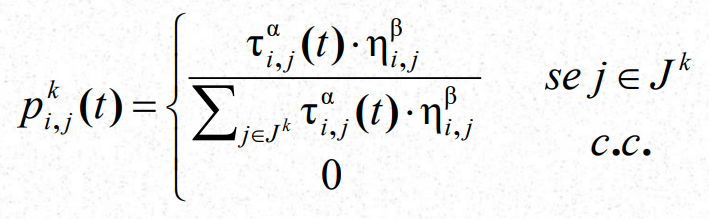
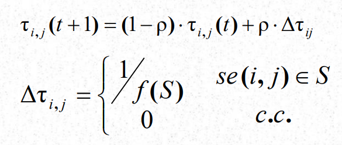

## ACO implementation

### The motivation
In this project I implemented ACO for fun. ACO stands for ant colony optimization ant it is a metaheuristic, which is basicaly an algorithm that can be used to solve a vast variety of problems. 

Here I've used Godot because I wanted to visualize the behavior of our ants.

Like I said before, the algorithm can be used to find a good solution a lot of problems. It was first used in the salesman traveller problem. In our case, I just want to test the algorithm first. So I decided to make a simple problem, to find a path between the food and the colony. Of course, It is idiotic to use ACO to solve this problem, just use Djikstra already. But I just want to check the convergence first. Later implementations I'll show working in STP. 

### The explanation
The algorithm is implemented using the following probabilistic formula:

The $p^{k}$$_{i,j}(t)$ is the probability to the and $k$ go from the vertex $i$ to $j$ at iteration $t$.
The $\tau_{i,j}(t)$ is the amout of pheromone that exists on the edge $<i,j>$ at iteration t. 
The $\eta_{i,j}$ is any heurist you can use. In our case is $\frac{1}{len(<i,j>)}$, this way the ant will has greater probability to go to the nearest vertex. 
When you see "se $j\in J^{k}$" you can read "if $j\in J^{k}$", I was too lazy when I print the formula, so It is in portuguese. By the way, $J^{k}$ is the set of vertices not visited by the ant $k$.
We can see that the more pheromone and the less the distance between vertex $i$ and $j$, the higher the probability of the ant go from $i$ to $j$. If the vertex is already visited, the ant won't go to there. 
Okay, but what about $\alpha$ and $\beta$ ? They are both constants defined before the execution. They define the importance balance between pheromone and the heuristic. 

To update the pheromone, we used the default formula:

Here we have a new constant $\rho$ which is used to define the evaporation of the pheromone. Each iteration the pheromone is updated. 
The $\Delta\tau_{i,j}$ is the amount of pheromone injected in the edge. The lesser the solution lenght $f(S)$ is, the more pheromone we put in it. 

### How to use the project

The project still incomplete, unfortunely I started when my vocations were finishing. But you can use godot and run the scene AntDynamicSimulation and see the convergence happening between paths. (Or just watch a video in youtube lol)

### Next steps
I will work in the project providing a single scene with a better UI, and also use the ACO to solve TCP. Fixing grammar errors in this readme because I'm not good in grammar in my mother language, let alone in english.